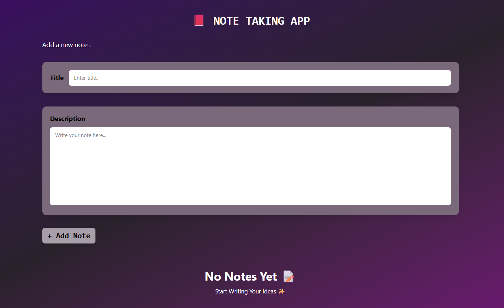
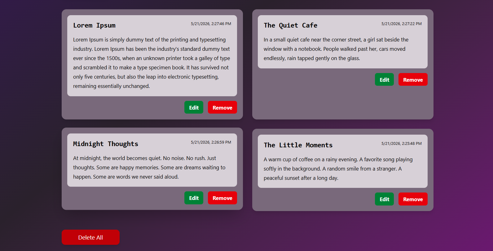

# 📕 Note Taking App

A simple and responsive Note Taking App built using **HTML**, **Tailwind CSS**, and **Vanilla JavaScript**.  
This app allows users to create, edit, delete, and store notes using Local Storage.

---

## ✨ Features

- ➕ Add new notes
- ✏️ Edit existing notes
- ❌ Remove notes
- 🗑️ Delete all notes
- 💾 Notes saved in Local Storage
- 🎨 Responsive modern UI
- ⚡ Smooth animations and hover effects

---

## 🚀 Live Demo

🔗 https://achu19desg.github.io/NoteApp/

---

## 📸 Screenshots

### Home Page

### Notes Section

---

## 🛠️ Built With

- HTML5
- Tailwind CSS
- Vanilla JavaScript

---

## 👩‍💻 Author

**Archana P**
